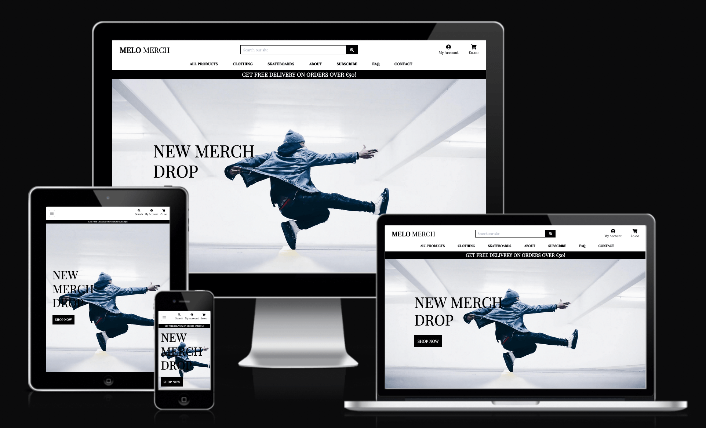
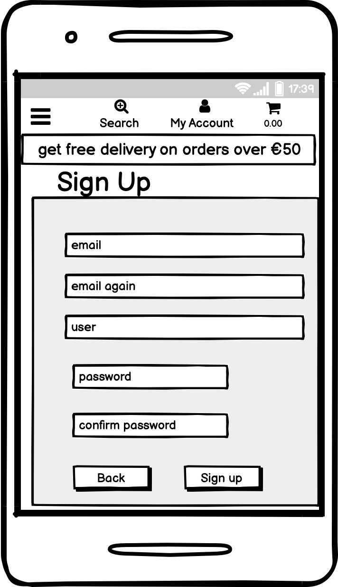
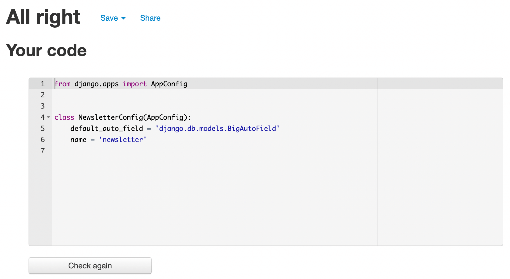

# Melo Merch

[Melo Merch](https://github.com/richardreiter/melo-merch) is an online Business-to-Consumer (B2C) e-commerce website dedicated to selling streetwear fashion apparel and skater products such as tees, hoodies, shorts, hats and skateboards.



Visit the live site [here.](https://melo-merch.herokuapp.com/)

## UX (User Experience)

### Project Goals

- Create a fully functional e-commerce website to allow users to purchase streetwear fashion products - including features (but not limited to) such as easy payment gateway, authentication system, search and filter functionality, high quality product images, clear product descriptions, ratings, shopping cart and a single payment system.

### Target Audience

- Anyone who is into streetwear fashion and skateboarding.
- People looking to purchase a present for someone who's into streetwear/skateboarding.

### User Stories

Agile methodology tool:

  - GitHub Projects was used to create and [manage a Kanban board](https://github.com/richardreiter/melo-merch/projects/1), for planning and implementing this project's functionalities.


- As a Site User I can register for an account so that I have my personal account information.
- As a Site user I can login/logout of my account so that I have access to my account details.
- As a Site User I can recover my password in case I forget it so that I can regain access to my account.
- As a Site User I can receive an email confirmation after registration so that I can confirm my account creation.
- As a Site User I can personalise the user profile so that I can view my order history/confirmations/save my payment information.
- As a Shopper I can browse a list of products so that I can pick some I'd like to buy.
- As a Shopper I can view a certain product's details so that I see a full description, ratings, picture, sizes.
- As a Shopper I can see my cart total anytime so that I can be within budget.
- As a Shopper I can view a category of a product so that I can easily find a product I'm interested in without having to browse too much.
- As a Shopper I can sort the products' list so that I can sort products by specific filters.
- As a Shopper I can sort more than one category so that I can better tailor the filters to my needs.
- As a Shopper I can search/query a product so that I can find a specific product easily.
- As a Shopper I can pick size/quantity of product when buying it so that I don't accidentally select the wrong size/quantity.
- As a Shopper I can see the items in my cart so that I can have control over my spending.
- As a Shopper I can update the amount of items in my cart so that I can make adjustments before checking out.
- As a Shopper I can put my card details with ease so that I can quickly checkout.
- As a Shopper I can safely input my details so that my details are secure.
- As a Shopper I can view my order and confirmation of the order after checking out so that I can double-check the order is correct.
- As a Shopper I can get an email confirmation of my order so that I can keep for my records.
- As a Site Admin I can add a product so that I can keep the inventory updated with new merch.
- As a Site Admin I can update a product so that I can change the price/image/description/name.
- As a Site Admin I can delete a product so that I can delete items which I no longer wish to sell.
- As a Site User I can see a custom 404 page so that I'm not confused on why I didn't land on the page I had intended to.
- As a Shopper/Potential Shopper I can find a contact page so that I can easily contact the shop with any questions/concerns.
- As a Shopper I can subscribe to a newsletter so that I can keep up to date with new collections, sales, discounts.
- As a Shop Owner I can link a privacy policy so that shoppers know how their data is collected and processed.
- As a Site Owner I can improve my SEO so that I improve my search engine ranking.
- As a Shop Owner I can create a FB business page so that I can gain more traction from socials.
- As a Shopper I can see a FAQ page so that I can find the most frequently asked questions, without having to contact the shop.
- As a Shopper I can see an about page from the shop so that I can learn more about its story, and gain trust from the brand.

### Wireframes

The mockups below were done with the help of Balsamiq (for both desktop and mobile screens), these were useful to help visualise the project.

- Desktop:
  - Home page
  
  - Products page 
  
  - Product Detail page
  
  - Cart page
  
  - Checkout page
  
  - Sign Up page
  
  - Login page
  
  - About page
  
  - Subscribe page
  
  - FAQ page
  
  - Contact page
  

- Mobile:
  - Home page
  
  - Products page 
  
  - Cart page
  
  - Sign Up page
  
  - Login page
  
  - About page
  
  - Subscribe page
  
  - FAQ page
  
  - Contact page
  

The database schema was generated with [django-extensions](https://django-extensions.readthedocs.io/en/latest/index.html) [Graph models.](https://django-extensions.readthedocs.io/en/latest/graph_models.html)

- Database Schema
  

### Design

- The colour scheme is gold old fashion/classic black & white - [contrast passes a11y validation.](https://color.a11y.com/)


- [Google Fonts](https://fonts.google.com/) was used for the website's font. The Playfair Display font was used as it gives an air of elegance and it's a stylish font.

## Features

### Existing Features

- __Navigation Bar__

  - Navigation is a fully responsive feature on all pages (with different versions user's role dependant and whether the user is logged in/out), it includes links on the site's Logo (displaying to the left within the bar), Search Bar in the middle, My Account and Shopping car to the right. All Products, Clothing, Skateboards, About, Subscribe, FAQ and Contact Pages are located under the search bar. The Register and Login pages are located in a submenu upon clicking My Account (the 'Product Management' and "Mail Newsletter" pages/nav links only show up for superusers).
    
  - The Logout nav link shows up (and both Register/Login nav links disappear) once the user has successfully registered/logged in.
    
    
  - The navigation looks the same in each page to allow for easy navigation (without the user having to use the ‘back’ button), taking the user through a logical journey.
  - This section makes it easy for the user to learn more about the site's different sections and contents.
  - The search box makes it easy for the shopper/user to search fo a specific item.
    
  - My Account icon expands upon click with a sub-menu.
    
  - Cart icon reflects on the current state of how much the shopper will spend, if the shopper clicks on the icon, it will bring them to the Cart Page.
    
  - All Products nav link expands upon click with a sub-menu, shoppers are able to see all products sorted by price, rating, category.
    
  - Clothing nav link expands upon click with a sub-menu, shoppers are able to see all clothing apparel sorted by their categories (tees, hoodies, shorts, hats).
    
  - Skateboards nav link expands upon click with a sub-menu, shoppers are able to see all skateboards sorted by their categories (penny boards, regular boards, long boards).
    

- __Free Delivery Banner__

  - The Free Delivery Banner is there to entice shoppers to purchase more than €50 in order to get free delivery.
    

- __CTA - Call to Action button__

  - The Shop Now button is there to entice shoppers to take the action of shopping.
    

- __Footer__

  - The footer area consists of a link to the site's Privacy Policy and three social links (Facebook, Instagram and Twitter - all of them, if clicked, open on a separate tab).
  - Like the navigation section, the footer looks the same on each page (and features on all of the pages) to allow for easy navigation, taking the user through a logical journey.


- __Products Page__

  - The Products Page features a sort by box where the shopper can sort products by Price (low to high), Price (high to low), Rating (low to high), Rating (high to low), Name (A-Z), Name (Z-A), Category (A-Z), Category (Z-A).
  - Users are able to see the products details', such as photo, name, price, category, rating, description.
  - If a user clicks on a photo it brings the user to that Product's Detail Page.
  - A back to top arrow up button can be found at the bottom right of the page.


- __Product Detail Page__

  - The Product Detail Page features its product's image (which fully opens in a new tab upon click), name, price, category, size (if product has one), if it's limited edition or not, rating, description.
  - Users are able to click on the input box's -/+ buttons to choose the quantity of the product they wish to add to their cart.


- __Cart Page__

  - The Cart Page features all the products which are currently in the cart, their images, names, sizes, sku, price, quantity, subtotal, cart total, delivery charge, grand total.
  - Users are able to click on the input box's -/+ buttons to change the number of a certain product and also update/remove them from their cart if they wish to.
  - Shoppers can click on the Secure Checkout button to head to the Checkout Page.


- __Checkout Page__

  - The Checkout Page features the order summary to the right.
  - A form to the left which users need to fill out with their personal details, delivery address and card payment information, in order to complete their order.
  - If the shopper hasn't got an account they can create one or login to save their personal details.
  - The user can click on the Adjust cart button if they wish to make any last minute amendments.
  - If the user clicks on the Complete Order button they are redirected to the Checkout Success Page.


- __Checkout Success Page__

  - The Checkout Success Page features the successful order info and delivery details.
  - Shoppers are able to click on a CTA button at the bottom of the page to check the shop's tees.


- __Profile Page__

  - If the shopper is registered and logged in, they are able to access the Profile Page, which features the user's Default Delivery Information (where they can update).
  - Shoppers are also able to see their order history information such as order number (also click on it), date, items and the total.


- __About Page__

  - The About Page features a bit of the shop's history/mission/ethos.


- __Subscribe Page__

  - Shoppers are able to subscribe to the website's newsletter in order to receive stay up-to-date with latest merch drops, collections, sales and discounts.
  - Email validation is in place, and once a user fills out their email and click on the subscribe button, a success toast message comes up, and their email is saved to the database.


- __Mail Newsletter Page__

  - **Only superusers** are able to view this page, where they are able to mail a newsletter straight from the frontend (or backend) to their subscriber's list saved in the database.
  - Once a message is sent it is also recorded to the database.


- __Product Management Page__

  - **Only superusers** are able to view this page, where they are able to add new products to the site straight from the frontend via a form.


- __FAQ Page__

  - With the shopper's most frequently asked questions, it features an accordion (collapsible content), if the shopper clicks on a certain question it expands/collapes it.


- __Contact Page__

  - Shoppers are able to contact the shop in case they have any questions/feedback/concerns.
  - Once the form is submitted it records to the database.


### Features Left to Implement

- __Wish list__

  - Implementing a wish list option would be beneficial for the Melo Merch users, as they would be able to save products that they are keen on buying at a later stage.

- __Testimonial__

  - Implementing a product testimonial option would be valuable for the shop users, as it could help them make learn more about possible purchases, and gain more trust within the website and the Melo Merch brand itself.

## Web Marketing

### SEO

- [Google](https://www.google.com/)
  - Google's Autocomplete was used to get some ideas of keywords for SEO
    
  - Google's "People Also Ask" was used to get even more ideas of keywords for SEO
    

- [Wordtracker](https://www.wordtracker.com/)
  - Wordtracker was used as a keyword research tool for both short and long-tail keywords
    

- __Meta Tags__

  - Description: "Irish underground streetwear for lowkey skateboarders"

  - Keywords: underground streetwear, 90s skater fashion, lowkey streetwear tee, lowkey brand, undeground clothing brand, skateboards ireland, streetwear brand hoodies, pennyboards ireland, skateboarder hats, irish skate shorts

### Marketing Research

- Who are our users?
  - People who are into streetwear fashion and skateboarding.

- Which online platforms would we find lots of our users?
  - Since the majority of our users are teenagers/young adults, we mostly find them in social media.

- Would our users use social media? If yes, which platforms do we think we would find them on?
  - Absolutely, we can find them on TikTok, Instagram and Facebook.

- What do our users need? Could we meet that need with useful content? If yes, how could we best deliver that content to them?
  - Quality streetwear fashion apparel and skateboards. We can deliver useful content for instance with fashion tips newsletters, or posts to our social media following.

- Would our business run sales or offer discounts? How do we think our users would most like to hear about these offers?
  - Most definitely, our users would like to hear about discounts through social media and newsletters.

- Would our business have a budget to spend on advertising? Or would it need to work with free or low cost options to market itself?
  - Since our business is still growing and not quite estabilished yet, for the time being we'd try to grow organically with free social media posts, posting fashion tips/trends on a daily basis.

### Social Media

- __Facebook Page__

  - Users can visit [Melo Merch's Facebook Business Page clicking here.](https://www.facebook.com/Melo-Merch-100754669406133/)
      
      

### Email Marketing

- __Newsletter Subscription Page__

  - Shoppers are able to subscribe to the website's newsletter in order to receive emails with latest merch drops, collections, sales and discounts.
  

- __Mail Newsletter Page__

  - **Only superusers** are able to mail a newsletter straight from the frontend (or backend) to their subscriber's list saved in the database.
  

## Technologies Used

### Languages Used

- [HTML5](https://developer.mozilla.org/en-US/docs/Glossary/HTML5)
- [CSS3](https://developer.mozilla.org/en-US/docs/Web/CSS)
- [JavaScript](https://developer.mozilla.org/en-US/docs/Web/JavaScript)
- [Python3](https://developer.mozilla.org/en-US/docs/Glossary/Python)

### Frameworks, Libraries & Programs Used

- [Balsamiq](https://balsamiq.com/)
  - Balsamiq was used to make desktop/mobile mockups in order to visualise the project.
- [Bootstrap](https://getbootstrap.com/)
  - Bootstrap template.
- [Amazon S3](https://aws.amazon.com/s3/)
  - Amazon Simple Storage Service was used to store the project's static files such as media, CSS and JavaScript.
- [Django](https://www.djangoproject.com/)
  - Django was used to build the app.
- [Django Allauth](https://django-allauth.readthedocs.io/en/latest/overview.html/)
  - Django allauth for account management.
- [Django Crispy Forms](https://django-crispy-forms.readthedocs.io/en/latest/)
  - Django Crispy Forms for rendering elegant DRY forms.
- [Font Awesome](https://fontawesome.com/)
  - Font Awesome was used to add icons to improve the design of the website.
- [Git](https://git-scm.com/) & [Gitpod](https://gitpod.io/)
  - Git was used for version control via the Gitpod terminal in order to commit to Git and push to GitHub.
- [GitHub](https://github.com/)
  - GitHub was used for version control.
- [Google Fonts](https://fonts.google.com/)
  - Google Fonts was used to import the font which is used on the website.
- [Heroku](https://heroku.com/)
  - Heroku was used for hosting and deploying the application.
- [Django-extensions](https://django-extensions.readthedocs.io/en/latest/index.html)
   - The database schema was generated with [django-extensions](https://django-extensions.readthedocs.io/en/latest/index.html) [Graph models.](https://django-extensions.readthedocs.io/en/latest/graph_models.html)
- [Django-pandas](https://pypi.org/project/django-pandas/)
  - Pandas was used to help manipulate data to mail the newsletters to the site's subscribers.
- [PostgreSQL](https://www.postgresql.org/)
  - PostgreSQL for database management.
- [Stripe](https://stripe.com/ie)
  - Stripe for the payments infrastructure.

## Testing

- Manual testing:
  
  - All links, form submissions, admin privileges, user privileges, app functions were throughouly tested and work as intended.

### Testing User Stories

__All user stories were manually tested__

- As a Site User I can register for an account so that I have my personal account information.
  - User clicks on the navigation bar's icon "My Account", "Register".
  - User fills out sign up form (validation in place), press sign up.
  - The page and a toast message tell the user a confirmation email was sent.
  - User checks their email inbox and click on the link to confirm the email.
  - User is finally fully registered and able to login.

- As Site User I can login/logout of my account so that I have access to my account profile details and previous orders.
  - Users are able to log in clicking on the navigation bar's icon "My Account", "Login/Logout" and view previous orders in the profile tab in the "My Account", "My Profile".

- As a Site User I can recover my password in case I forget it so that I can regain access to my account.
  - User goes to the login page.
  - User clicks on "Forgot Password?"
  - User fills out their email address and click on "Reset My Password".
  - User checks their email inbox and click on the link to reset and choose a new password.

- As a Site User I can personalise the user profile so that I can view my order history/confirmations/save my billing information.
  - Users clicks on the navigation bar's icon "My Account", "My Profile" and view order history/confirmation/save billing address.

- As a Shopper I can browse a list of products so that I can pick some I'd like to buy.
  - User is greeted by a CTA button at the home/landing page "Shop Now", which will bring them to all the products.
  - User can click on the nav link "ALL PRODUCTS" and pick if they'd like to sort by price, rating, category,

- As a Shopper I can view a certain product's details so that I see a full description, ratings, picture, sizes.
  - From the products page, user clicks on any product and will be brought out to the product's detail page, including the product description, rating, picture and sizes available.

- As a Shopper I can see my cart total anytime so that I can be within budget.
  - The navbar features a cart icon which reflects in real-time the current state of their cart once a user adds/removes/updates any cart items, the price changes.

- As a Shopper I can view a category of a product so that I can easily find a product I'm interested in without having to browse too much.
  - User clicks on "Clothing" or "Skateboards" and can click on a specific category.

- As a Shopper I can sort the products' list so that I can sort products by specific filters.
  - User clicks on "All Products" and from there can select by price, rating, category or all products.
  - User can click on a dropdown box and sort products by Price (low to high/high to low), Rating (low to high/high to low)

- As a Shopper I can sort more than one category so that I can better tailor the filters to my needs.
  - User clicks on "All Clothing" or "All Skateboards"
  - User is able to filter/sort by price/name/rating or sub-category.

- As a Shopper I can search/query a product so that I can find a specific product easily.
  - User clicks on the permanent nav bar search box.
  - User inputs a keyword and press enter or clicks on the magnifying glass icon/button
  - Search query results is returned, user is also able to sort the results by price, rating, name or category.

- As a Shopper I can pick size/quantity of product when buying it so that I don't accidentally select the wrong size/quantity.
  - If a certain product has different sizes, at its product detail page, a dropdown box will appear and the user is able to pick different sizes (S/M/L) and quantities of a particular size.

- As a Shopper I can see the items in my cart so that I can have control over my spending.
  - The cart icon at the navigation bar reflects the current spending, if the users clicks on it, it brings them to the cart page, where they can see a breakdown of all the products in the cart, pricing and delivery fee (if any).

- As a Shopper I can update the amount of items in my cart so that I can make adjustments before checking out.
  - On the cart page, users are able to update quantity or delete any products which are currently in their cart.

- As a Shopper I can put my card details with ease so that I can quickly checkout.
  - On the checkout page, users are prompted wich a form where they fill out their personal and delivery details, and the card number (all through HTTPS) and Stripe handles the payment securely.

- As a Shopper I can safely input my details so that my details are secure.
  - The website uses Hypertext Transfer Protocol Secure and also Stripe payments infrastructure to handle the payment.

- As a Shopper I can view my order and confirmation of the order after checking out so that I can double-check the order is correct.
  - As soon as a user completes the order, they are redirected to the Checkout Success page, with their order information, the order is also saved to their Profile page.

- As a Shopper I can get an email confirmation of my order so that I can keep for my records.
  - As soon as a user completes the order, they will receive a confirmation email from the shop, containing their order information.

- As a Site Admin I can add a product so that I can keep the inventory updated with new merch.
  - Superusers are able to view a page called "Product Management", where they are able to add new products to the site straight from the frontend via a form.

- As a Site Admin I can update a product so that I can change the price/image/description/name.
  - Once a superuser is logged in, they are able to see an "Edit" link right under each product from the Products Page, where they are able to update any product.

- As a Site Admin I can delete a product so that I can delete items which I no longer wish to sell.
  - Once a superuser is logged in, they are able to see an "Delete" link right under each product from the Products Page, where they are able to delete any product.

- As a Site User I can see a custom 404 page so that I'm not confused on why I didn't land on the page I had intended to.
  - The website features a clear custom 404 page which displays a big heading stating "THE PAGE YOU ARE LOOKING FOR ISN'T AVAILABLE", and a CTA button right under it "RETURN TO SHOP".

- As a Shopper/Potential Shopper I can find a contact page so that I can easily contact the shop with any questions/concerns.
  - Users are able to contact the shop clicking on the permanent navigation bar Contact Page link.
  - Once there, users are greeted with a straight forward form where they are able to contact the shop.

- As a Shopper I can subscribe to a newsletter so that I can keep up to date with new collections, sales, discounts.
  - Users are able to subscribe to the shop's newsletter by clicking on the permanent navigation bar "Subscribe" link.
  - Once there, users are able to input their email and subscribe to the shop's newsletter.

- As a Shop Owner I can link a privacy policy so that shoppers know how their data is collected and processed.
  - The footer area consists of a permanent "Privacy Policy" link to the site's Privacy Policy, where users can click on it (opens in a new tab) and learn more about it.

- As a Site Owner I can improve my SEO so that I improve my search engine ranking.
  - The website contains a sitemap.xml file, a robots.txt file, meta description tag and a meta keyword tag, with a mix of short and longtail keywords.

- As a Shop Owner I can create a FB business page so that I can gain more traction from socials.
  - The website features social icons in the footer area, if a user clicks on the Facebook icon, it brings them to the shop's FB Business Page.

- As a Shopper I can see a FAQ page so that I can find the most frequently asked questions, without having to contact the shop.
  - Users are able to read the shop's most Frequently Asked Questions by clicking on the permanent navigation bar "FAQ" link.
  - At the page there's an accordion with the questions and answers.

- As a Shopper I can see an about page from the shop so that I can learn more about its story, and gain trust from the brand.
  - Users are able to learn more about the the shop clicking on the permanent navigation bar "About" page link.
  - Once there, users can read more about the website's brand story/mission/ethos.

### Validator Testing

- HTML
  - No errors/warnings were returned when passing through the official [W3C validator](https://validator.w3.org/nu/?doc=https%3A%2F%2Fmelo-merch.herokuapp.com%2F)
    - Landing/Home Page result:
    
    - Products Page result:
    
    - Product Detail Page result:
    
    - About Page result:
    
    - Subscribe Page result:
    
    - FAQ Page result:
    
    - Contact Page result:
    
    - Cart Page result:
    
    - Login Page result:
    
    - Register Page result:
    
    - Checkout Page result:
    

- CSS
  - No errors were found when passing through the [Jigsaw CSS validator](https://jigsaw.w3.org/css-validator/validator?uri=https%3A%2F%2Fmelo-merch.herokuapp.com%2F&profile=css3svg&usermedium=all&warning=1&vextwarning=&lang=en)
    - base result:
    
    - checkout result:
    
    - profile result:
    

- JavaScript
  - [JShint Code quality tool](https://jshint.com/) was used to validate the JavaScript, all the JavaScript code is validating without any warnings, except for the quantity_input_script [which is a bug fix for Code Institute's Boutique Ado Walkthrough Project](https://github.com/Code-Institute-Solutions/boutique_ado_v1/commit/de7ad2067ac1b5de37a4cd8b9f4ddf572a4bf6c7), it returns seven warnings:
  
  
  
  

- Python
    - No errors were returned when passing through the [online PEP8 checker.](http://pep8online.com/), except for the webhook_handler.py (please see screenshot in the checkout app), which returned one E501 warning, line too long (81 > 79 characters), I wasn't able to do a line break without breaking the code.
      - melo_merch:
      
      
      - cart app:
      
      
      
      - checkout app:
      
      
      
      
      
      
      
      
      
      
      - home app:
      
      
      
      - newsletter app:
      
      
      
      
      
      
      - products app:
      
      
      
      
      
      
      - users app:
      
      
      
      
      

### Google Lighthouse

### Color Contrast Accessibility Checker

### Responsive Testing

### Device Testing

### Browser Testing

### Known Bugs

## Deployment

### Deployment to Heroku

[This project](https://melo-merch.herokuapp.com/) was deployed on [Heroku](https://heroku.com/) using the following steps:

__Procfile & requirements.txt__ 
  - In GitPod's terminal, type ```pip3 freeze --local > requirements.txt``` to create the requirements file.
  - Create a new Procfile at the project's root directory and add the code: ```web: gunicorn melo_merch.wsgi``` .
  - Push to repo.

__Create a Heroku App__
  - Log into Heroku
  - Select "New" and "Create new app".
  - Name the new app, choose the region and click "Create app".

__Environment Variables__
  - Click the 'Settings' tab towards the top of the page.
  - Locate the 'Config Vars' and click 'Reveal Config Vars'.
  - Enter all variables needed:
    - SECRET_KEY - `<Random key generated>`.
    - DATABASE_URL - `<Postgres generated>`.
    - USE_AWS: `True`.
    - AWS_ACCESS_KEY_ID: `<AWS access key id, generated in the AWS console after user creation>`.
    - AWS_SECRET_ACCESS_KEY: `<secret AWS access key, generated in the AWS console after user creation>`.
    - STRIPE_PUBLIC_KEY: `<Stripe public key from the Stripe dashboard>`.
    - STRIPE_SECRET_KEY: `<Stripe secret key from the Stripe dashboard>`.
    - STRIPE_WH_SECRET: `<Stripe webhook key>`.
    - EMAIL_HOST_USER - `<site's email address>`. 
    - EMAIL_HOST_PASS - `<password from the email above>`.

__Heroku Postgres Database__
  - Go to the resources tab in Heroku.
  - In the Add-ons search for Heroku Postgres, select it.
  - Choose the Hobby Dev-Free option in plans.
  - Click submit order form.
  - Go to your local environment and install:
    - `pip3 install dj_databse_url`
    - `pip3 install psycopg2-binary`
    - Add these to the requirements.txt file using `pip3 freeze > requirements.txt`

__Connect to GitHub__
  - From the dash, click on the 'Deploy' tab.
  - At the 'Deployment Method' select 'GitHub'.
  - Type your repo's name.
  - When you have located the correct repository, click 'Connect'.

__Deploy__
  - Click "Deploy" at the top to go to the Deployment settings tab.
  - Choose "GitHub" as the deployment method.
  - Choose "Automatic deploys" if you would like to enable a chosen branch to be automatically deployed with every GitHub push to the branch.
  - Use "Manual deploy" to deploy the current state of a branch to this app (simply enter the name of the branch and "Deploy Branch").
  - Once the deployment has completed click on "View app".

### Forking the Repository

By forking the GitHub Repository you make a copy of the original repository on you GitHub account to view and/or make changes without affecting the original repository.

To achieve that simply:

- Log into GitHub.
- Locate the GitHub Repository in question.
- At the top of the repository, on the right side of the page, select "Fork".
- You should now have a copy of the original repository in your GitHub account.

### Creating a Clone

How to run this project locally:

- Install the GitPod Browser Extension for Google Chrome.
- Log into GitHub.
- Locate the GitHub Repository you'd like to clone.
- Click the green "GitPod" button in the top right corner of the repository. This will create a new GitPod workspace.

## Credits 

### Content

- The instructions on [how to reset/remove the latest Git commit from a repo](https://gist.github.com/CrookedNumber/8964442) were taken from [this GitHub Gist.](https://gist.github.com/CrookedNumber/8964442)
- Many thanks to Kenneth Broni for the ["Build a Newsletter Section for Your Django Web Application"](https://www.youtube.com/watch?v=hWtlskOaFNI) which was a good reference and example. 
- A huge thank you to Chris Zielinski and Code Institute for the ["Boutique Ado" Walkthrough project](https://github.com/Code-Institute-Solutions/boutique_ado_v1) which was a great reference, inspiration and example.

### Media

- All the website's images were taken from [Unsplash.](https://unsplash.com/)
- Some of the FAQ page's content was inspired from [asos](https://www.asos.com/customer-care/).
- Some of the About page's content was inspired from [HBX](https://hbx.com/about).

### Other

- Many thanks to my mentor, for his advice, guidance and feedback.
- Thanks to Code Institute's Tutor Support, for their help.
- Thanks to Code Institute's Slack community, for their support.